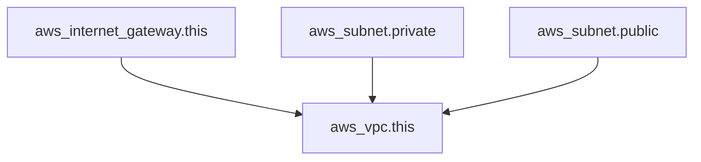

# vpc Dependencies

This graph shows which resources or module calls in the unit refer to other Terraform objects.

Edges are `consumer → referenced dependency`.

```mermaid
graph TD
  n0["aws_internet_gateway.this"]
  n1["aws_subnet.private"]
  n2["aws_subnet.public"]
  n3["aws_vpc.this"]
  n0 --> n3
  n1 --> n3
  n2 --> n3
```
