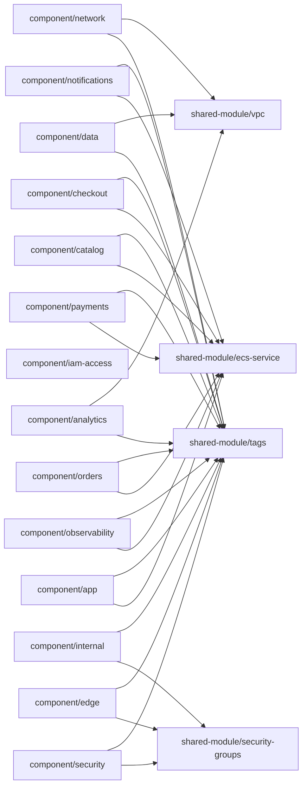

# tfscaffold Topology

## Edges

- `n0` -> `n16`
- `n0` -> `n17`
- `n1` -> `n14`
- `n1` -> `n16`
- `n10` -> `n14`
- `n10` -> `n16`
- `n11` -> `n14`
- `n11` -> `n16`
- `n12` -> `n14`
- `n12` -> `n16`
- `n13` -> `n15`
- `n13` -> `n16`
- `n2` -> `n14`
- `n2` -> `n16`
- `n3` -> `n14`
- `n3` -> `n16`
- `n4` -> `n16`
- `n4` -> `n17`
- `n5` -> `n15`
- `n5` -> `n16`
- `n7` -> `n15`
- `n7` -> `n16`
- `n8` -> `n16`
- `n8` -> `n17`
- `n9` -> `n14`
- `n9` -> `n16`
